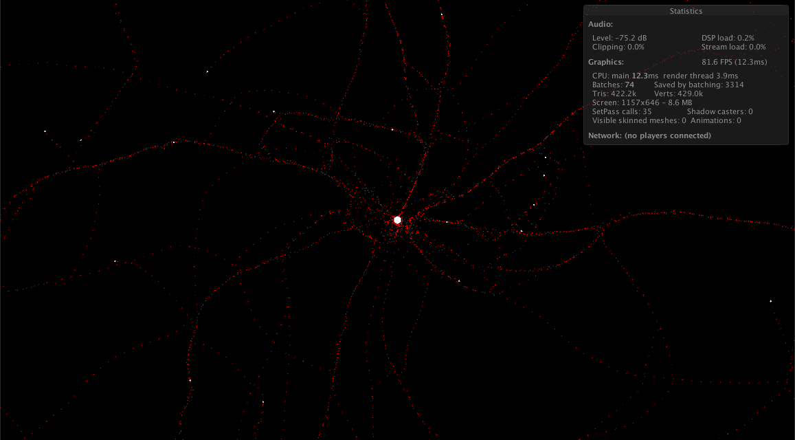

# ant-simulator

[Demo](https://ceritium.github.io/ant-simulator/)

# TODO:

Actions:

- [x] Random* ants movement
- [x] Ants track pheromones
- [x] Pheromones lifespan.
- Found food.
- Add food to the nest.
- Ant dies if not found the nest after a while.
- Create ants from nest food

UI:

- Zoom camera
- Game stats

Improvements:

- Performance problem with pheromones, solutions: 
  - Aggregate pheromones colliders avoid colliders
  - Index feromones and delegate detection to ants. Indexig pheromones instead of use colliders allow add intensity to pheromones.
  
Objective:

Make a game.
